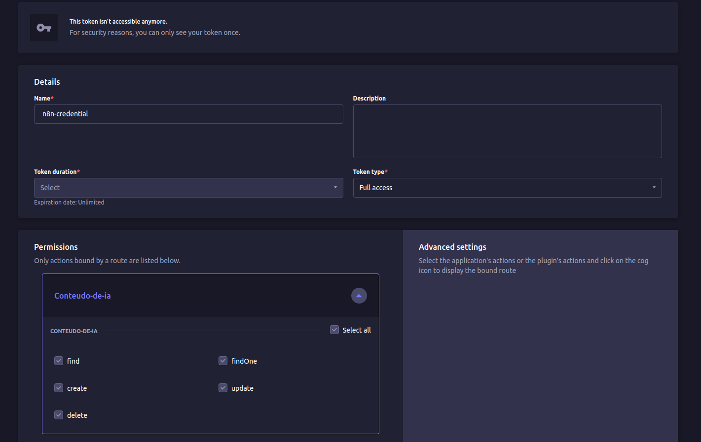
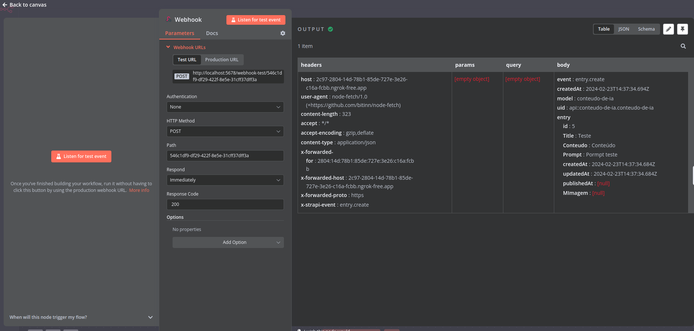
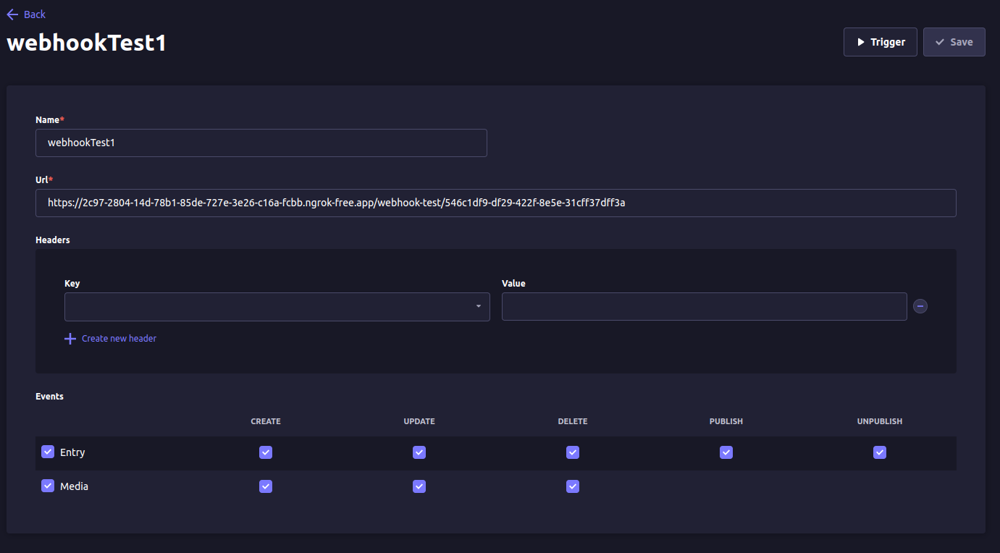
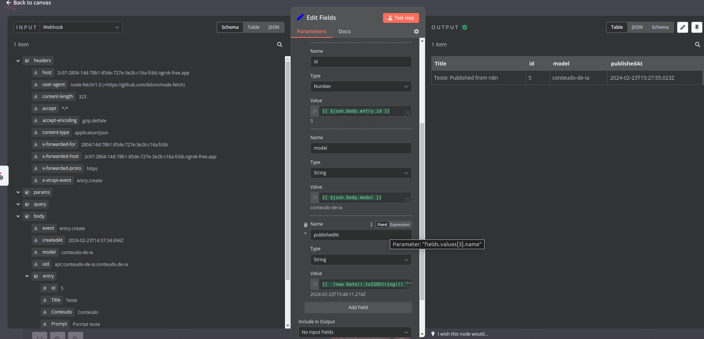
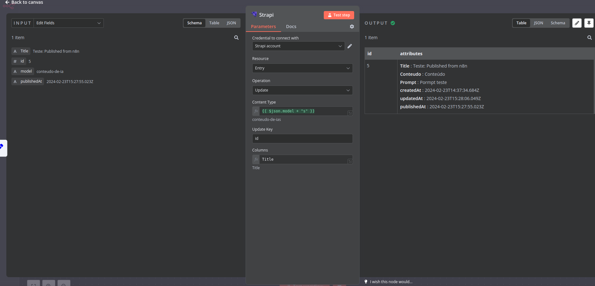

# Creating a n8n workflow to update and publish Strapi entries

First step to create a n8n workflow to update Strapi entries is to connect both through webhooks.

Having your Strapi up and running, create a content type you want to automate. Then, go to settings and create an API token to secure your actions. For this example, I have a `n8n-credential` with full access and unlimited duration, and gave all permissions to my content type `conteudo-de-ia`. Note that my token is not showing anymore, so save your token when creating before leave the page.

In your n8n, create a Webhook trigger with POST as HTTP method. Then, get the webhook URL (you can use Test URL for manual changes, but must use Production URL when activate the webhook to run automatically).

Back to Strapi, it's time to setup another webhook. Go to settings and create a new webhook. In URL field, you will insert the n8n webhook and configure the events that you want to allow.

With both webhooks up and running, every time you create or update an entry, your n8n will trigger with the event.

Back to n8n, create a SET node to make some data changes. In my example, I'm taking id and model from the entry, concatenating entry title with ': Published from n8n' with some Javascript code `{{ $json.body.entry.Title.concat(": Published from n8n") }}` and creating a new field publishedAt setting current date with `{{  (new Date().toISOString()) }}`. With this field, I will publish the entry exactly when it's created.

The last node is a Strapi node. It's a Update operation for Entry resource. You have to setup the Strapi API token with your Strapi URL (in my case, I have used `http:<my_ip>:1337` since Strapi is running in my machine, but n8n is running in a Docker container). Also, set up API version to the Strapi version you're using.

You need to setup the content type with plural, since Strapi API uses the plural name. In my example, I just concatenated with "s" because I hadn't the plural value. Then, I named my update key as `id` and the columns I want to update `Title, publishedAt`.

Finally, activate the workflow and it's done. You can create a new entry with Strapi and it will be updated and published by n8n without the need to any further changes in the Strapi entry.

And remember, this is just a proof of concept to send data from Strapi to n8n and vice versa. There is a lot of more things you can do, like validate data with n8n using an external API, send data to Strapi using a built in form in your website and a lot of more. Just be creative!
